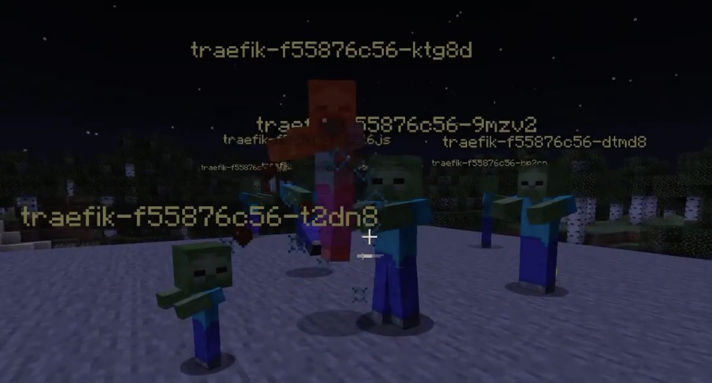

# Minecraft x Kubernetes ⚔️🧱

View and fight Kubernetes resources, specifically pods, in Minecraft.

This project polls the Kubernetes API from a server-side Bukkit plugin and then translates that into in-game mobs.

Supports Java edition servers running Bukkit. Since this focuses on stable
APIs I assume it will work on any number of versions.

## Example

Or on YouTube

## Related projects

- [Client-side Java edition Forge mod](https://github.com/gashirar/KubeChaosCraftMod?files=1) by Gashirar
- [Server-side Bedrock edition MCWSS plugin](https://github.com/erjadi/kubecraftadmin) by Eric Jadi
- [Moleculer micro-service visualizer](https://github.com/OutdatedVersion/minecraft-moleculer-visualizer)
- [Sorting algorithm visualizer](https://github.com/OutdatedVersion/minecraft-sorting-visualization)

## Wishlist

- Support more resources
  - I got side tracked by switching to the event system below and stopped adding meaningful features
- Async event based system to support larger clusters
  - Even a reasonably sane cluster will lock the main server thread
  - Similar to [this similar visualizer](https://github.com/OutdatedVersion/minecraft-moleculer-visualizer/blob/be64bdc0162d761cb8b22129de2bce107d2adda7/src/main/kotlin/com/outdatedversion/moleculer/visualizer/moleculer/MoleculerBridge.kt#L117)
- Gamify further
